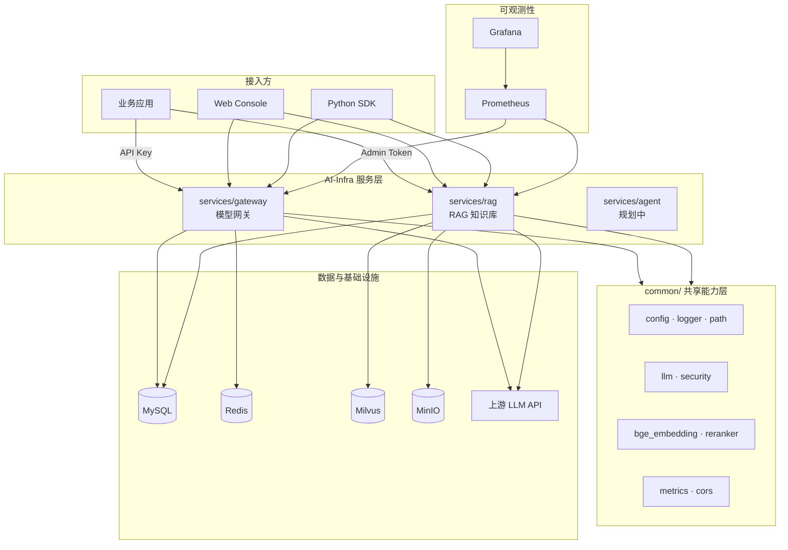

# AI-Infra

企业级 **AI 中台**基础设施项目。将大模型调用、知识库问答、向量检索、权限治理、可观测性等 AI 能力沉淀为**统一、可复用、可治理**的平台服务，供多条业务线快速接入，避免重复建设。

**运行与部署 → [run.md](run.md)** · **Python SDK → [sdk/python/README.md](sdk/python/README.md)**

---

## 快速导航

| 文档 | 内容 |
|------|------|
| [run.md](run.md) | 环境配置、Docker / 本地 / K8s 部署、API 调用、排障 |
| [sdk/python/README.md](sdk/python/README.md) | Python SDK 安装与示例 |
| `.env.example` | 全部环境变量模板 |

---

## AI 中台主要是做什么的？

### 一句话定义

**AI 中台 = 企业内部的「AI 能力操作系统」**——业务应用不直接对接各家模型厂商、不各自维护向量库和 Prompt，而是统一走中台提供的标准 API，由中台负责路由、鉴权、计量、知识管理与运维监控。

### 解决的核心问题

| 痛点（没有中台） | 中台如何解决 |
|------------------|--------------|
| 各业务线重复申请 API Key、重复集成 OpenAI 协议 | 统一 **Gateway**，OpenAI 兼容接口，一次接入处处可用 |
| 每个团队自建 RAG、各自维护 Milvus / Embedding | 统一 **RAG 服务**，共享知识库 pipeline 与向量基础设施 |
| Token 消耗不可见，成本无法分摊 | **用量日志 + 限流 + 监控**，按租户 / Key 计量 |
| 模型切换（GPT → DeepSeek → 本地模型）改造成本高 | **上游抽象层**，业务侧模型名不变或最小改动 |
| 敏感数据出网合规风险 | 支持 **本地 BGE + 私有化部署**，数据留在内网 |
| 运维分散、故障难定位 | **统一日志、Prometheus 指标、Grafana 看板** |

### 在企业架构中的位置

```
┌─────────────────────────────────────────────────────────┐
│  业务前台（面向用户的产品）                                │
│  智能客服 · 文档问答 · 代码助手 · 内部 Copilot · BI 分析   │
└───────────────────────────┬─────────────────────────────┘
                            │ HTTP / SDK
┌───────────────────────────▼─────────────────────────────┐
│  AI 中台（AI-Infra）← 本项目                              │
│  模型网关 · RAG ·（规划）Agent · 治理 · 控制台 · 监控      │
└───────────────────────────┬─────────────────────────────┘
                            │
┌───────────────────────────▼─────────────────────────────┐
│  基础设施                                                │
│  K8s · MySQL · Redis · Milvus · MinIO · GPU · 对象存储    │
└─────────────────────────────────────────────────────────┘
```

### 核心目标

| 目标 | 含义 |
|------|------|
| **复用** | 一套 RAG、一套网关，N 个业务接入 |
| **降本** | 统一采购/路由模型，避免重复部署 Embedding 与向量库 |
| **提速** | 新业务从「从零搭 AI」变为「申请 Key + 调 API」 |
| **可控** | 权限、审计、限流、成本、合规集中管理 |

---

## 平台功能总览

### 已实现功能（✅）

| 能力域 | 功能 | 说明 |
|--------|------|------|
| **模型接入** | OpenAI 兼容对话 API | `POST /v1/chat/completions`，支持流式 SSE |
| **模型接入** | 多模型列表与路由 | 通过配置支持多个上游模型名 |
| **安全治理** | API Key 鉴权 | 业务调用携带 Bearer Token，Key 哈希存储 |
| **安全治理** | Admin Token 管理鉴权 | 知识库、Key 管理等运维操作独立鉴权 |
| **安全治理** | 限流 | Redis 滑动窗口，按 Key 限制 RPM |
| **安全治理** | 用量计量 | 记录 Token 数、延迟、成功/失败状态 |
| **知识库** | 知识库 CRUD | 多知识库、租户 ID 隔离 |
| **知识库** | 文档上传与 ingestion | txt / md / pdf 解析 → 分块 → 向量化 → 入库 |
| **知识库** | 向量检索 | Milvus 相似度召回 |
| **知识库** | Rerank 精排 | BGE Reranker 对召回结果重排序 |
| **知识库** | RAG 问答 | 检索 + LLM 生成，返回答案与引用来源 |
| **Embedding** | 双模式 | API Embedding 或本地 BGE-M3，`auto` 自动切换 |
| **运维** | Web 管理控制台 | 概览、Key 管理、知识库、在线问答测试 |
| **运维** | Python SDK | Gateway / RAG 客户端封装 |
| **运维** | 日志 | 统一写入 `logs/app.log` |
| **运维** | Prometheus 指标 | Gateway / RAG 暴露 `/metrics` |
| **部署** | Docker Compose | 本地与开发环境一键启动 |
| **部署** | Kubernetes | 生产级 manifests + Kustomize |
| **部署** | Grafana 监控 | K8s 下 Prometheus + Grafana |

### 规划中功能（🔲）

| 能力域 | 功能 | 优先级建议 |
|--------|------|------------|
| **Agent** | 多步推理、工具调用、MCP 协议 | 高 |
| **推理** | 自托管 vLLM / Ollama 模型服务 | 高 |
| **模型** | 智能路由（按任务复杂度选大小模型） | 高 |
| **RAG** | 混合检索（向量 + 关键词 BM25） | 中 |
| **RAG** | 父子块 / 语义分块策略 | 中 |
| **治理** | 多租户配额与计费账单 | 中 |
| **治理** | 审计日志与操作追溯 | 中 |
| **观测** | Langfuse / OpenTelemetry 全链路 Trace | 中 |
| **MLOps** | 微调流水线、模型版本管理 | 低 |
| **应用** | Prompt 模板管理与 A/B 测试 | 中 |
| **应用** | 低代码 Agent 编排 UI | 低 |

---

## 系统架构



### 典型请求链路

**① 对话（Gateway）**

```
业务应用
  → Authorization: Bearer <API Key>
  → Gateway 鉴权 + 限流
  → 代理上游 LLM（OpenAI 兼容）
  → 返回生成结果 + 写入 usage_logs
```

**② 知识库问答（RAG）**

```
业务 / 控制台
  → Authorization: Bearer <Admin Token>
  → 上传文档：解析 → 分块 → Embedding → Milvus
  → 提问：Query Embedding → 向量召回 (K×M)
  → BGE Rerank 精排 → Top K 片段
  → LLM 基于上下文生成答案 + 返回 sources 引用
```

---

## 模块详解

### 一、业务服务层

#### 1. `services/gateway` — 模型网关（Phase 1）

**作用：** 所有大模型调用的**统一入口**，业务应用只需对接 Gateway，无需直接接触 OpenAI / 通义 / DeepSeek 等厂商。

| 子模块 | 文件 | 作用 |
|--------|------|------|
| 鉴权 | `auth.py` | API Key 校验、Key 生成与哈希存储 |
| 限流 | `rate_limit.py` | Redis 滑动窗口，防止单 Key 打爆 |
| 代理 | `proxy.py` | 转发 `/v1/chat/completions` 到上游，支持流式 |
| 管理 | `routers/admin.py` | 创建/列表 API Key、查询可用模型 |
| 对话 | `routers/chat.py` | 对外暴露 OpenAI 兼容对话接口 |
| 数据 | `models.py` | `api_keys`、`usage_logs` 表 |

**适用场景：** 智能客服对话、文本生成、代码补全、任意 Chat 类应用。

**端口：** `8080` · **API 文档：** `/docs`

---

#### 2. `services/rag` — RAG 知识库服务（Phase 2/3）

**作用：** 企业文档的**统一知识管理 + 检索问答**中心，避免每个业务重复建设向量库与 ingestion pipeline。

| 子模块 | 文件 | 作用 |
|--------|------|------|
| 知识库 API | `routers/knowledge_bases.py` | 知识库 CRUD、租户隔离 |
| 文档 API | `routers/documents.py` | 上传、列表、删除文档 |
| 检索 API | `routers/retrieve.py` | 纯向量检索，返回相关片段 |
| 问答 API | `routers/chat.py` | RAG 端到端问答 |
| 文档解析 | `services/parser.py` | txt / md / pdf 文本提取 |
| 分块 | `services/chunker.py` | 固定长度 + overlap 分块 |
| 向量化 | `services/embedder.py` | BGE-M3 或 API Embedding |
| 向量库 | `services/milvus_store.py` | Milvus 写入、检索、删除 |
| 精排 | `services/reranker.py` | BGE Reranker 重排序 |
| 入库 | `services/ingestion.py` | 上传 → 解析 → 分块 → 向量 → 入库 |
| 问答链 | `services/rag_chain.py` | 检索 + LLM 生成 + 引用组装 |

**适用场景：** 内部文档问答、产品手册助手、客服知识库、合规制度查询。

**端口：** `8081` · **API 文档：** `/docs`

---

#### 3. `services/agent` — Agent 运行时（🔲 规划中）

**预期作用：** 支持多步任务自动化——LLM 规划 → 调用工具（HTTP / SQL / 内部 API / MCP）→ 汇总结果。

**预期能力：**

- 工具注册中心与权限控制
- 会话状态与记忆持久化
- 人机协同（HITL）中断与恢复
- 与 Gateway、RAG 组合：先检索再行动

---

#### 4. `services/inference` — 自托管推理（🔲 规划中）

**预期作用：** 在内网部署开源大模型（Qwen、DeepSeek、Llama），通过 vLLM / TGI 提供推理，数据不出域。

**预期能力：**

- GPU 资源调度与副本扩缩
- 与 Gateway 集成，作为上游 Provider
- 模型版本管理与灰度发布

---

### 二、共享能力层 `common/`

所有 Python 服务共用，**禁止反向依赖** `services/` 下的业务代码。

| 模块 | 文件 | 作用 |
|------|------|------|
| **配置中心** | `config.py` | 读取根目录 `.env`，提供 `conf` 单例；MySQL/Redis URL、Embedding 后端判断等 |
| **日志** | `logger.py` | 统一 `my_logger`，输出到控制台 + `logs/app.log` |
| **路径** | `path_utils.py` | `get_file_path()` 基于项目根目录解析路径 |
| **LLM 客户端** | `llm.py` | LangChain `ChatOpenAI`，RAG 问答使用 |
| **Admin 鉴权** | `security.py` | 校验 Admin Token，Gateway Admin 与 RAG 共用 |
| **BGE Embedding** | `bge_embedding.py` | 加载 BGE-M3，输出 1024 维 dense 向量 |
| **BGE Rerank** | `bge_reranker.py` | 加载 bge-reranker-base，query-passage 精排 |
| **Prometheus** | `metrics.py` | FastAPI `/metrics` 自动埋点 |
| **CORS** | `cors.py` | 控制台跨域配置 |

**设计原则：** 配置、日志、模型客户端、鉴权逻辑**只写一次**，各服务复用。

---

### 三、接入层

#### 5. `web/console` — Web 管理控制台（Phase 4）

**作用：** 为运维与算法同学提供**可视化管控面**，无需手写 curl 即可完成日常管理。

| 页面 | 功能 |
|------|------|
| 概览 | Gateway / RAG 健康状态、Embedding 后端、可用模型 |
| API Keys | 创建与查看 Gateway API Key |
| 知识库 | 创建/删除知识库、上传文档、在线 RAG 问答测试 |

**技术栈：** Vue 3 + Vite · Docker 下 Nginx 反向代理 `/api/gateway`、`/api/rag`

**端口：** `3000`（Docker）/ `5173`（开发）

---

#### 6. `sdk/python` — Python SDK（Phase 4）

**作用：** 封装 HTTP 调用细节，业务后端**几行代码**接入中台。

| 客户端 | 主要方法 |
|--------|----------|
| `GatewayClient` | `create_api_key`、`chat_completions`、`list_models` |
| `RagClient` | `create_knowledge_base`、`upload_document`、`retrieve`、`chat` |

**适用：** 后端服务集成、脚本自动化、Notebook 实验。

---

### 四、部署与运维层

#### 7. `deploy/docker-compose` — 本地 / 开发部署

**作用：** 一条命令启动完整栈，适合开发、演示、POC。

**包含服务：** MySQL、Redis、etcd、MinIO、Milvus、Gateway、RAG、Console

**启动：** `.\scripts\start.ps1` 或 `./scripts/start.sh`

---

#### 8. `deploy/k8s` — 生产 Kubernetes 部署（Phase 5）

**作用：** 生产环境的容器编排、持久化存储、多副本与监控。

| 资源 | 说明 |
|------|------|
| `configmap.yaml` | 非敏感环境变量 |
| Secret（脚本生成） | API Key、数据库密码、Admin Token |
| `gateway.yaml` | Gateway Deployment × 2 副本 |
| `rag.yaml` | RAG Deployment + 数据/模型 PVC |
| `monitoring/` | Prometheus + Grafana |
| `kustomization.yaml` | Kustomize 统一入口 |

**部署：** `.\scripts\k8s_deploy.ps1`

---

#### 9. `scripts/` — 运维脚本

| 脚本 | 作用 |
|------|------|
| `start.ps1` / `start.sh` | Docker Compose 一键启动 |
| `run_gateway.py` / `run_rag.py` | 本地开发启动服务 |
| `run_console.ps1` | 本地启动前端 |
| `download_bge_models.py` | 从 HuggingFace 下载 BGE 模型 |
| `k8s_deploy.ps1` | K8s 构建 + 部署 |
| `init_db.sql` | MySQL 全量表结构 |

---

### 五、基础设施组件

| 组件 | 在项目中的角色 |
|------|----------------|
| **MySQL** | 存储 API Key、用量日志、知识库元数据、文档状态 |
| **Redis** | Gateway 限流计数器 |
| **Milvus** | 向量存储与相似度检索 |
| **MinIO** | Milvus 底层对象存储（Milvus 依赖） |
| **etcd** | Milvus 元数据协调（Milvus 依赖） |
| **上游 LLM API** | 对话生成、RAG 问答、API 模式 Embedding |
| **Prometheus** | 抓取 `/metrics`，存储时序指标 |
| **Grafana** | 指标可视化与告警看板 |

---

## 项目目录结构

```
AI-Infra/
├── common/                     # 共享能力层
├── services/
│   ├── gateway/                # 模型网关 ✅
│   ├── rag/                    # RAG 知识库 ✅
│   ├── agent/                  # Agent 运行时 🔲
│   └── inference/              # 自托管推理 🔲
├── web/console/                # 管理控制台 ✅
├── sdk/python/                 # Python SDK ✅
├── deploy/
│   ├── docker-compose/         # 本地部署 ✅
│   └── k8s/                    # K8s + 监控 ✅
├── scripts/                    # 运维脚本
├── data/                       # 知识库文档（运行时）
├── models/                     # 本地 BGE 模型（运行时）
├── logs/                       # 运行日志
├── .env                        # 统一配置
├── run.md                      # 运行手册
└── README.md                   # 本文档
```

---

## 技术栈

| 类别 | 选型 |
|------|------|
| 后端 | FastAPI + Uvicorn |
| 关系库 | MySQL 8 |
| 缓存 | Redis 7 |
| 向量库 | Milvus 2.4 |
| 对象存储 | MinIO |
| Embedding | BGE-M3（本地）/ OpenAI 兼容 API |
| Rerank | bge-reranker-base |
| LLM 调用 | LangChain + OpenAI 兼容 API |
| 前端 | Vue 3 + Vite |
| 容器 | Docker Compose / Kubernetes |
| 监控 | Prometheus + Grafana |

---

## 建设阶段

| 阶段 | 内容 | 状态 |
|------|------|------|
| Phase 1 | 统一模型网关 | ✅ |
| Phase 2 | RAG 知识库 + Milvus | ✅ |
| Phase 3 | 本地 BGE Embedding + Rerank | ✅ |
| Phase 4 | Web 控制台 + Python SDK | ✅ |
| Phase 5 | K8s 部署 + Prometheus/Grafana | ✅ |
| Phase 6+ | Agent、自托管推理、治理增强 | 🔲 |

---

## 后续优化方向

### 1. 性能与成本

| 优化项 | 说明 | 预期收益 |
|--------|------|----------|
| **模型智能路由** | 简单任务路由小模型，复杂任务路由大模型 | 降低 30–60% Token 成本 |
| **响应缓存** | 相同 Prompt + 参数缓存 LLM 响应 | 降延迟、降成本 |
| **Embedding 批处理与缓存** | 文档 embedding 批量写入，Query 缓存 | 提升 ingestion 与检索吞吐 |
| **Gateway 异步化** | 长任务走消息队列，避免阻塞 HTTP | 提升并发稳定性 |
| **RAG 混合检索** | 向量 + BM25 关键词融合 | 提升专有名词、编号类查询召回 |
| **GPU 推理池** | vLLM 连续批处理，动态扩缩 | 提高 GPU 利用率 |

### 2. RAG 质量

| 优化项 | 说明 |
|--------|------|
| **文档解析增强** | 支持 Word、HTML、表格、扫描 PDF（OCR） |
| **语义分块 / 父子块** | 小块检索、大块生成，减少上下文断裂 |
| **多路召回融合** | 向量 + 关键词 + 元数据过滤 |
| **评测体系** | 离线评测集（准确率、召回率、幻觉率）+ 在线反馈 |
| **HyDE / Query 改写** | 提升口语化提问的检索效果 |
| **引用可信度标注** | 返回片段置信度，低置信度时拒答 |

### 3. 治理与安全

| 优化项 | 说明 |
|--------|------|
| **RBAC 权限模型** | 按组织 / 项目 / 角色控制模型、知识库访问 |
| **多租户配额** | 每租户 Token 上限、知识库容量上限 |
| **计费与账单** | 按租户 / 项目出账，对接财务系统 |
| **审计日志** | 谁、何时、调用了什么、输入输出摘要 |
| **内容安全** | 敏感词过滤、PII 脱敏、Prompt 注入防护 |
| **Secret 管理** | Vault / K8s External Secrets 替代明文 .env |

### 4. 可观测性

| 优化项 | 说明 |
|--------|------|
| **全链路 Trace** | Langfuse / OpenTelemetry，定位慢请求 |
| **LLM 专项观测** | Token 消耗趋势、模型错误率、P99 延迟 |
| **RAG 专项指标** | 召回数、Rerank 分数分布、幻觉反馈率 |
| **告警规则** | 错误率、延迟、磁盘、Milvus 健康告警 |
| **日志集中化** | Loki / ELK 统一检索 |

### 5. 工程与运维

| 优化项 | 说明 |
|--------|------|
| **CI/CD 流水线** | 构建、测试、镜像推送、K8s 滚动发布 |
| **Helm Chart** | 替代裸 YAML，支持多环境 values |
| **健康检查完善** | _startup probe_ 适配 RAG 模型冷启动 |
| **HPA 自动扩缩** | Gateway 按 QPS、RAG 按队列深度扩缩 |
| **多环境隔离** | dev / staging / prod 配置与集群分离 |

---

## 可加功能路线图

按推荐优先级排列，可在现有架构上增量演进：

### P0 — 高优先级（建议下一步）

```
1. Agent 运行时（services/agent）
   - 工具注册（HTTP、SQL、内部 API）
   - MCP 协议支持
   - 与 RAG 组合：先检索知识再调用工具

2. 自托管推理（services/inference）
   - vLLM 部署 Qwen / DeepSeek
   - Gateway 增加本地模型路由

3. 模型智能路由
   - 按 token 长度 / 任务类型选择模型
   - Fallback：主模型失败自动切换备用
```

### P1 — 中优先级

```
4. Prompt 管理
   - 模板 CRUD、版本、变量替换
   - A/B 测试不同 Prompt 效果

5. 混合检索 RAG
   - Milvus 向量 + Elasticsearch BM25
   - Reciprocal Rank Fusion 融合

6. 多租户治理
   - 租户配额、用量统计、简单账单
   - 控制台按租户隔离视图

7. 全链路 Trace
   - 接入 Langfuse
   - 单次 RAG 请求：检索片段 + LLM 输入输出可追溯
```

### P2 — 增强体验

```
8. 异步文档处理
   - 上传后立即返回，后台 Celery / Redis Queue ingestion
   - 控制台展示处理进度

9. 知识库增量更新
   - 文档 diff 检测，仅更新变化 chunk
   - 定时同步外部数据源（Confluence、飞书文档）

10. 多模态支持
    - 图片 OCR 入库
    - ASR 音频转写入库

11. TypeScript / Java SDK
    - 与 Python SDK 对齐
```

### P3 — 长期能力

```
12. MLOps 微调流水线
    - 标注 → LoRA 微调 → 评估 → 发布
    - 模型注册表与灰度

13. 低代码 Agent 编排 UI
    - 可视化拖拽工作流（类似 Dify）

14. AI 评测平台
    - 批量跑评测集、对比不同 RAG 策略 / 模型

15. 联邦检索
    - 跨多个知识库联合问答
    - 统一权限控制
```

---

## 设计原则

1. **协议标准化** — 对外 OpenAI 兼容，降低业务改造成本
2. **能力原子化** — Gateway、RAG、Agent 独立部署、独立扩缩
3. **配置单点** — 根目录 `.env` + `common/config.py`
4. **先场景后平台** — 用 1–2 个真实业务验证，再抽象通用能力
5. **数据分级** — 敏感数据走本地模型，一般数据可走 API

---

## 服务端口一览

| 服务 | 端口 | 说明 |
|------|------|------|
| Gateway | 8080 | 模型 API |
| RAG | 8081 | 知识库 API |
| Console | 3000 | Web 管理台 |
| MySQL | 3306 | 元数据库 |
| Redis | 6379 | 限流 |
| Milvus | 19530 | 向量检索 |
| MinIO | 9000 / 9001 | 对象存储 |
| Grafana (K8s) | 30300 | 监控看板 |

---

## 相关链接

| 链接 | 说明 |
|------|------|
| [run.md](run.md) | 完整运行手册 |
| [sdk/python/README.md](sdk/python/README.md) | Python SDK |
| http://localhost:8080/docs | Gateway API（启动后） |
| http://localhost:8081/docs | RAG API（启动后） |
| http://localhost:3000 | Web 控制台（启动后） |

---

## License

See [LICENSE](LICENSE).
