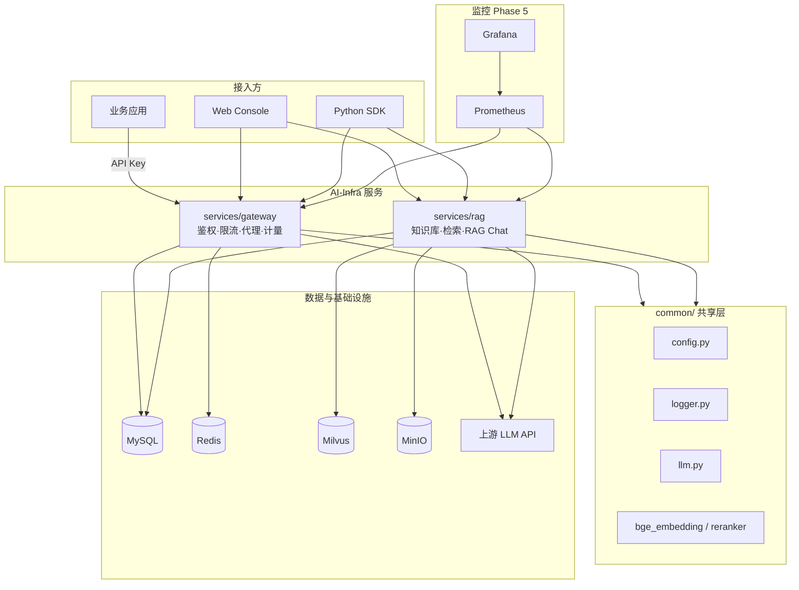
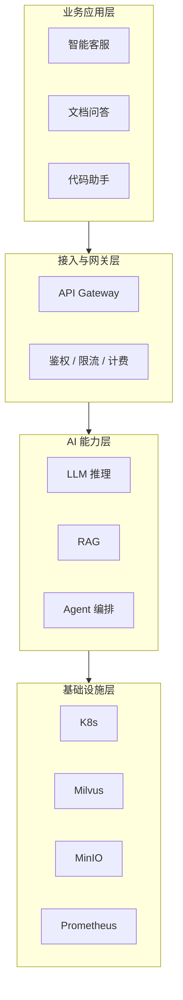

# AI-Infra

企业级 AI 中台基础设施。统一模型网关、RAG 知识库、本地 Embedding/Rerank、管理控制台与 K8s 监控，供多业务线复用 AI 能力。

**运行与部署请阅读 → [run.md](run.md)**

---

## 快速导航

| 文档 | 内容 |
|------|------|
| [run.md](run.md) | 环境配置、Docker / 本地 / K8s 部署、API 调用、排障 |
| [sdk/python/README.md](sdk/python/README.md) | Python SDK 安装与示例 |
| `.env.example` | 全部环境变量模板 |

---

## 已实现能力

| 模块 | 服务 | 端口 | 状态 |
|------|------|------|------|
| 模型网关 | `services/gateway` | 8080 | ✅ Phase 1 |
| RAG 知识库 | `services/rag` | 8081 | ✅ Phase 2 |
| 本地 BGE + Rerank | `common/bge_*` | — | ✅ Phase 3 |
| 管理控制台 | `web/console` | 3000 | ✅ Phase 4 |
| Python SDK | `sdk/python` | — | ✅ Phase 4 |
| K8s + 监控 | `deploy/k8s` | — | ✅ Phase 5 |

---

## 系统架构（本项目）



### 请求链路

**对话（Gateway）**

```
业务 → Bearer API Key → Gateway → 上游 LLM（OpenAI 兼容）→ 响应 + 用量日志
```

**RAG 问答（RAG）**

```
业务 → Admin Token → RAG
  → 文档解析 / 分块 / Embedding（BGE-M3 或 API）
  → Milvus 向量召回 → BGE Rerank 精排 → common.llm 生成回答（带引用）
```

---

## 项目结构

```
AI-Infra/
├── common/                     # 共享：配置、日志、LLM、BGE、鉴权、指标
│   ├── config.py               # 读取根目录 .env
│   ├── logger.py               # logs/app.log
│   ├── llm.py                  # LangChain ChatOpenAI
│   ├── bge_embedding.py        # BGE-M3
│   ├── bge_reranker.py         # BGE Reranker
│   ├── security.py             # Admin Token 鉴权
│   └── metrics.py              # Prometheus /metrics
├── services/
│   ├── gateway/                # Phase 1：OpenAI 兼容网关
│   └── rag/                    # Phase 2/3：知识库 + RAG
├── web/console/                  # Phase 4：Vue3 管理台
├── sdk/python/                   # Phase 4：Python SDK
├── deploy/
│   ├── docker-compose/         # 本地 / 开发一键部署
│   └── k8s/                    # Phase 5：生产 K8s + 监控
├── scripts/                    # 启动、模型下载、K8s 脚本
├── data/                       # 知识库文档（运行时）
├── models/                     # 本地 BGE 模型（运行时）
├── logs/                       # 运行日志
├── .env                        # 统一配置（从 .env.example 复制）
├── run.md                        # ⭐ 完整运行文档
└── README.md                     # 本文档：架构与设计说明
```

---

## 核心模块说明

### Gateway（模型网关）

- OpenAI 兼容 `POST /v1/chat/completions`（含流式）
- API Key 鉴权 + Redis 限流
- Token 用量写入 MySQL
- Admin API：Key 管理、模型列表
- Prometheus 指标：`/metrics`

### RAG（知识库服务）

- 知识库 / 文档 CRUD，支持 `.txt` `.md` `.pdf`
- Embedding：`EMBEDDING_BACKEND=auto|api|bge`
- 检索 + BGE Rerank 精排 + LLM 问答（带引用来源）
- 租户字段 `tenant_id` 隔离元数据

### common（共享层）

所有服务通过 `PYTHONPATH=项目根目录` 引用 `common/`：

- 配置：根目录 `.env` 单点管理
- 日志：`logs/app.log`
- 路径：`get_file_path("data/...")` 相对项目根目录

---

## 技术栈（本项目）

| 类别 | 选型 |
|------|------|
| 后端框架 | FastAPI + Uvicorn |
| 关系库 | MySQL 8 |
| 缓存 | Redis 7 |
| 向量库 | Milvus 2.4（standalone） |
| 对象存储 | MinIO |
| Embedding | BGE-M3（本地）/ OpenAI API |
| Rerank | bge-reranker-base |
| LLM | LangChain + OpenAI 兼容 API |
| 前端控制台 | Vue 3 + Vite |
| 容器 | Docker Compose / Kubernetes |
| 监控 | Prometheus + Grafana |

---

## 分阶段规划

| 阶段 | 内容 | 状态 |
|------|------|------|
| Phase 1 | 统一模型网关 | ✅ 已完成 |
| Phase 2 | RAG 知识库 + Milvus | ✅ 已完成 |
| Phase 3 | 本地 BGE Embedding + Rerank | ✅ 已完成 |
| Phase 4 | Web 控制台 + Python SDK | ✅ 已完成 |
| Phase 5 | K8s 部署 + Prometheus/Grafana | ✅ 已完成 |
| 后续 | Agent 编排、MLOps、多模型路由 | 🔲 规划中 |

---

## 1. 什么是 AI 中台

**AI 中台**是企业级 AI 能力的**统一承载与复用层**，把分散在各业务线的模型调用、RAG、Agent 编排等能力沉淀为标准化、可治理、可复用的平台服务。

| 对比对象 | 作用 |
|---------|------|
| **业务前台** | 智能客服、文档问答、代码助手等具体应用 |
| **AI 中台** | 模型、RAG、工具、编排、监控等通用能力 |
| **基础设施** | GPU、K8s、存储、网络、安全 |

**核心目标：** 复用 · 降本 · 提速 · 可控

---

## 2. 为什么需要 AI 中台

```
没有中台：业务 A/B/C 各自购 API、自建向量库、重复造轮子
有中台：  业务 → 统一网关 / RAG → 监控、权限、审计 → 共享基础设施
```

---

## 3. 通用架构参考



---

## 4. 扩展方向（未实现）

以下能力可在现有架构上继续演进：

| 模块 | 说明 |
|------|------|
| Agent 运行时 | `services/agent`，工具注册、MCP、多步推理 |
| 推理服务 | `services/inference`，vLLM 自托管模型 |
| 训练 MLOps | 微调流水线、模型注册与灰度 |
| 全链路 Trace | Langfuse / OpenTelemetry |
| 多租户计费 | 按 Token / 租户配额与账单 |

---

## 5. 设计原则与注意事项

### 架构

1. **协议标准化** — 对外提供 OpenAI 兼容接口
2. **能力原子化** — Gateway / RAG 独立部署与扩缩容
3. **配置单点** — 根目录 `.env` + `common/config.py`
4. **先场景后平台** — 用真实业务验证再抽象

### 安全

- API Key / Admin Token 分离：业务走 Key，管理走 Admin
- 敏感信息仅放 `.env`，禁止提交仓库
- 生产环境 Secret 使用 Vault / K8s External Secrets

### RAG 质量

- 文档解析与分块质量优先于换模型
- API Embedding（1536 维）与 BGE（1024 维）不可混用同一 Milvus Collection
- 建立离线评测集持续迭代

### 常见坑

| 坑 | 说明 |
|----|------|
| 只做网关不做治理 | 成本与安全失控 |
| RAG 只堆向量库 | 解析/分块差则效果差 |
| 切换 Embedding 未换 Collection | Milvus 维度冲突 |
| 忽视观测 | 无法定位模型 / 检索 / Prompt 问题 |

---

## 6. 服务端口一览

| 服务 | 默认端口 | 说明 |
|------|----------|------|
| Gateway | 8080 | 模型 API |
| RAG | 8081 | 知识库 API |
| Console | 3000 | Web 管理台（Docker） |
| Console Dev | 5173 | Vite 开发服务器 |
| MySQL | 3306 | |
| Redis | 6379 | |
| Milvus | 19530 | gRPC |
| MinIO | 9000 / 9001 | API / Console |
| Grafana (K8s) | 30300 | NodePort |
| Console (K8s) | 30080 | NodePort |

---

## 7. 相关链接

- **运行文档**：[run.md](run.md)
- **Gateway API 文档**：http://localhost:8080/docs（启动后）
- **RAG API 文档**：http://localhost:8081/docs（启动后）
- **Python SDK**：[sdk/python/README.md](sdk/python/README.md)

---

## License

See [LICENSE](LICENSE).
